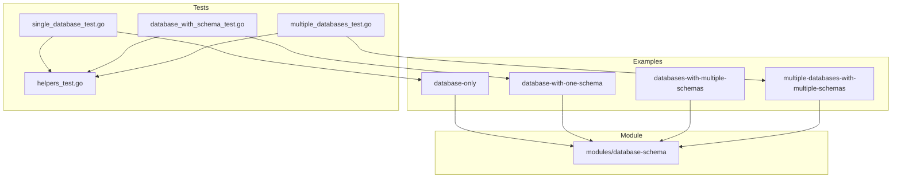

# Design Document: Database Examples and Tests

## Overview

This design document outlines the implementation approach for populating the Terraform Snowflake database-schema module examples and adding corresponding Terratest tests. The implementation follows existing patterns established in the repository for warehouse examples and tests.

The solution involves:
1. Creating four working Terraform example configurations demonstrating different usage patterns
2. Adding Go test files using Terratest to validate database and schema creation
3. Extending the test helper functions to support database and schema verification

## Architecture



## Components and Interfaces

### Example Configurations

Each example follows a consistent structure with four files:

#### File Structure
```
examples/{example-name}/
├── main.tf       # Module invocation and configuration
├── variables.tf  # Input variables including Snowflake auth
├── outputs.tf    # Output values from the module
└── versions.tf   # Terraform and provider version constraints
```

#### 1. database-only Example

**Purpose**: Demonstrates minimal database creation without schemas.

```hcl
# main.tf
module "database" {
  source = "../../modules/database-schema"

  database_configs = var.database_configs
}
```

**Default Configuration**:
```hcl
database_configs = {
  analytics = {
    name                        = "ANALYTICS_DB"
    comment                     = "Analytics database for reporting"
    data_retention_time_in_days = 1
    is_transient                = false
    schemas                     = []
  }
}
```

#### 2. database-with-one-schema Example

**Purpose**: Demonstrates database with a single schema including optional properties.

**Default Configuration**:
```hcl
database_configs = {
  app = {
    name    = "APPLICATION_DB"
    comment = "Main application database"
    schemas = [
      {
        name       = "PUBLIC_DATA"
        comment    = "Public facing data schema"
        is_managed = true
      }
    ]
  }
}
```

#### 3. databases-with-multiple-schemas Example

**Purpose**: Demonstrates single database with multiple schemas showing different configurations.

**Default Configuration**:
```hcl
database_configs = {
  datawarehouse = {
    name                        = "DATA_WAREHOUSE"
    comment                     = "Central data warehouse"
    data_retention_time_in_days = 7
    schemas = [
      {
        name       = "RAW"
        comment    = "Raw ingested data"
        is_managed = false
      },
      {
        name         = "STAGING"
        comment      = "Data transformation staging area"
        is_transient = true
      },
      {
        name                        = "CURATED"
        comment                     = "Curated business data"
        is_managed                  = true
        data_retention_time_in_days = 14
      }
    ]
  }
}
```

#### 4. multiple-databases-with-multiple-schemas Example

**Purpose**: Demonstrates complex multi-database setup with various configurations.

**Default Configuration**:
```hcl
database_configs = {
  production = {
    name    = "PROD_DB"
    comment = "Production database"
    schemas = [
      { name = "APP", comment = "Application schema" },
      { name = "AUDIT", comment = "Audit logging schema", is_managed = true }
    ]
  },
  development = {
    name         = "DEV_DB"
    comment      = "Development database"
    is_transient = true
    schemas = [
      { name = "SANDBOX", comment = "Developer sandbox" },
      { name = "TESTING", comment = "Test data schema", is_transient = true }
    ]
  }
}
```

### Test Components

#### Helper Functions (helpers_test.go additions)

```go
// DatabaseProps holds properties fetched from Snowflake
type DatabaseProps struct {
    Name                    string
    Comment                 string
    DataRetentionTimeInDays int
    IsTransient             bool
}

// SchemaProps holds schema properties fetched from Snowflake
type SchemaProps struct {
    Name                    string
    DatabaseName            string
    Comment                 string
    IsTransient             bool
    IsManagedAccess         bool
    DataRetentionTimeInDays int
}

// databaseExists checks if a database exists in Snowflake
func databaseExists(t *testing.T, db *sql.DB, databaseName string) bool

// schemaExists checks if a schema exists in a specific database
func schemaExists(t *testing.T, db *sql.DB, databaseName, schemaName string) bool

// fetchDatabaseProps retrieves database properties from Snowflake
func fetchDatabaseProps(t *testing.T, db *sql.DB, databaseName string) DatabaseProps

// fetchSchemaProps retrieves schema properties from Snowflake
func fetchSchemaProps(t *testing.T, db *sql.DB, databaseName, schemaName string) SchemaProps
```

#### Test Files

**single_database_test.go**:
- Tests database-only example
- Generates unique database name with `TT_DB_` prefix
- Verifies database existence and properties
- Uses `defer terraform.Destroy()` for cleanup

**database_with_schema_test.go**:
- Tests database-with-one-schema example
- Generates unique names for both database and schema
- Verifies database-schema relationship
- Validates schema properties (is_managed, comment)

**multiple_databases_test.go**:
- Tests multiple-databases-with-multiple-schemas example
- Creates multiple databases with unique names
- Verifies all databases and schemas exist
- Validates transient database configuration
- Validates schema-database associations

## Data Models

### Terraform Variable Structure

The `database_configs` variable follows this structure:

```hcl
variable "database_configs" {
  type = map(object({
    name                        = string           # Required: Database name
    comment                     = optional(string) # Optional: Description
    data_retention_time_in_days = optional(number) # Default: 1
    is_transient                = optional(bool)   # Default: false
    schemas = optional(list(object({
      name                        = string           # Required: Schema name
      comment                     = optional(string) # Optional: Description
      is_transient                = optional(bool)   # Default: false
      is_managed                  = optional(bool)   # Default: false
      data_retention_time_in_days = optional(number) # Default: null (inherit)
    })))
  }))
}
```

### Test Configuration Structure

Test configurations use Go maps that mirror the Terraform variable structure:

```go
databaseConfigs := map[string]interface{}{
    "db_key": map[string]interface{}{
        "name":                        "DATABASE_NAME",
        "comment":                     "Description",
        "data_retention_time_in_days": 1,
        "is_transient":                false,
        "schemas": []map[string]interface{}{
            {
                "name":       "SCHEMA_NAME",
                "comment":    "Schema description",
                "is_managed": true,
            },
        },
    },
}
```

## Correctness Properties

*A property is a characteristic or behavior that should hold true across all valid executions of a system—essentially, a formal statement about what the system should do. Properties serve as the bridge between human-readable specifications and machine-verifiable correctness guarantees.*

### Property 1: Database Creation Round-Trip

*For any* valid database configuration applied via Terraform, querying Snowflake after apply SHALL return a database with the specified name.

**Validates: Requirements 1.1, 5.2, 7.2**

### Property 2: Schema Creation Round-Trip

*For any* valid schema configuration within a database, querying Snowflake after apply SHALL return the schema associated with the correct parent database.

**Validates: Requirements 2.1, 3.1, 4.1, 6.2, 6.3, 7.3**

### Property 3: Configuration Fidelity

*For any* database or schema configuration, the created resource properties (comment, data_retention_time_in_days, is_managed) SHALL match the input configuration values.

**Validates: Requirements 5.3, 3.2, 3.4**

### Property 4: Transient Resource Handling

*For any* database or schema configured with `is_transient = true`, the created resource SHALL have the transient property correctly set in Snowflake.

**Validates: Requirements 4.2, 7.4**

## Error Handling

### Terraform Apply Errors

| Error Scenario | Handling |
|----------------|----------|
| Invalid database name | Terraform validation fails before apply |
| Invalid schema name | Terraform validation fails before apply |
| Duplicate database name | Snowflake returns error, Terraform reports failure |
| Duplicate schema name in same database | Snowflake returns error, Terraform reports failure |
| Insufficient permissions | Snowflake returns authorization error |
| Network connectivity issues | Terraform provider returns connection error |

### Test Error Handling

| Error Scenario | Handling |
|----------------|----------|
| Missing environment variables | Test fails with descriptive error via `mustEnv()` |
| Snowflake connection failure | Test fails with connection error |
| Resource not found after apply | Test assertion fails with resource name |
| Terraform apply failure | Terratest captures and reports error |
| Cleanup failure | Logged but test result preserved |

## Testing Strategy

### Dual Testing Approach

This implementation uses both unit-style verification and property-based validation:

1. **Unit Tests (Terratest)**: Verify specific example configurations work correctly
2. **Property Verification**: Each test validates properties that should hold for all valid configurations

### Test Configuration

- **Framework**: Terratest (Go testing framework for infrastructure)
- **Property Library**: Not applicable - Terratest uses assertion-based verification
- **Minimum Iterations**: Single apply/verify/destroy cycle per test (infrastructure tests are expensive)

### Test Files

| Test File | Example Tested | Properties Validated |
|-----------|----------------|---------------------|
| `single_database_test.go` | database-only | Property 1, Property 3 |
| `database_with_schema_test.go` | database-with-one-schema | Property 1, Property 2, Property 3 |
| `multiple_databases_test.go` | multiple-databases-with-multiple-schemas | Property 1, Property 2, Property 3, Property 4 |

### Test Execution Pattern

Each test follows this pattern:

```go
func TestExample(t *testing.T) {
    t.Parallel()
    
    // 1. Generate unique resource names
    unique := strings.ToUpper(random.UniqueId())
    dbName := fmt.Sprintf("TT_DB_%s", unique)
    
    // 2. Configure Terraform options
    tfOptions := &terraform.Options{
        TerraformDir: "../examples/{example}",
        Vars: map[string]interface{}{...},
    }
    
    // 3. Ensure cleanup
    defer terraform.Destroy(t, tfOptions)
    
    // 4. Apply configuration
    terraform.InitAndApply(t, tfOptions)
    
    // 5. Verify resources exist (Property 1, 2)
    db := openSnowflake(t)
    require.True(t, databaseExists(t, db, dbName))
    
    // 6. Verify properties match (Property 3, 4)
    props := fetchDatabaseProps(t, db, dbName)
    require.Equal(t, expectedComment, props.Comment)
}
```

### Property Test Annotations

Each test includes comments referencing the design properties:

```go
// Feature: database-examples-and-tests, Property 1: Database Creation Round-Trip
// Validates: Requirements 1.1, 5.2, 7.2
exists := databaseExists(t, db, dbName)
require.True(t, exists, "Database should exist after apply")

// Feature: database-examples-and-tests, Property 3: Configuration Fidelity
// Validates: Requirements 5.3, 3.2, 3.4
props := fetchDatabaseProps(t, db, dbName)
require.Equal(t, expectedComment, props.Comment)
```

